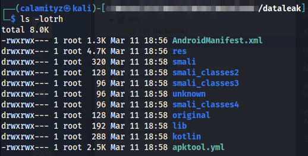
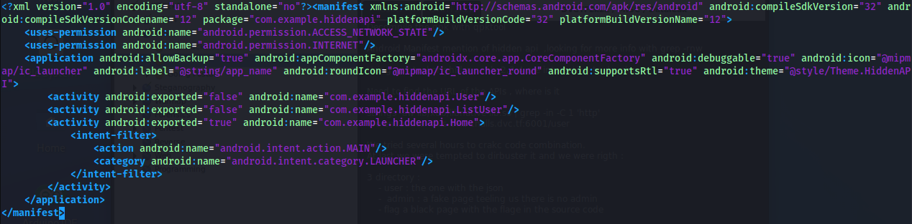
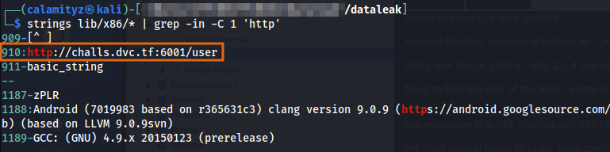
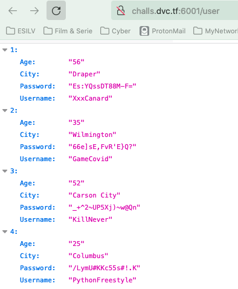
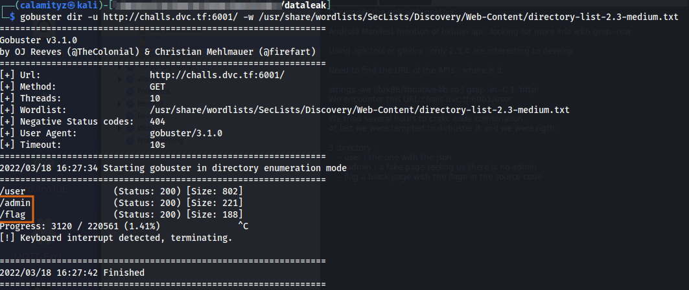
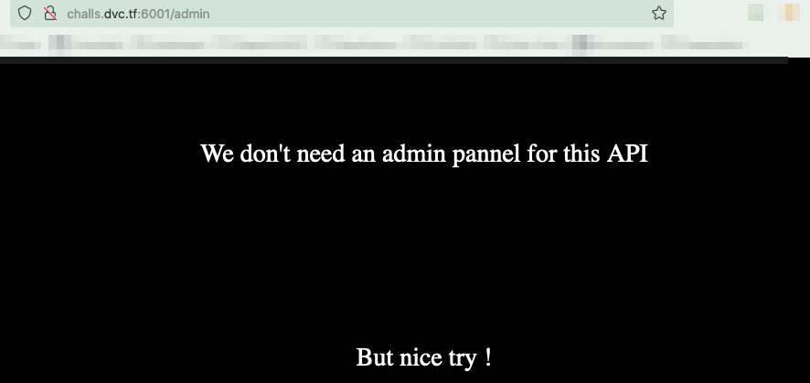
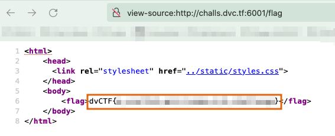

# Dataleak
⚔️  _Difficulty : Medium_
📝  _Category : None_
💯 _Number of points : 480_

```
A team of hackers recovered user information from a website. To share the information, they developed an application. You are sure that this application hides other information: can you find the hidden data?
````

**1.** We have this apk file that we need to reverse it to find clues. We used [apktool](https://ibotpeaches.github.io/Apktool/)And after running the command ```apktool d  dataleak.apk```. After decompilation we have the following data structure :



**2.** We read the **AndroidManifest.xml** file to look for the structure of the code and maybe to find some interesting data. We can see that there's a hidden API.



**3.** We are now looking for an API link in the code we've decompile. After looking in all files with a ```grep -r http```, we  don't find any valuables information. We tried to go deeper by greping http on a strings of all executable (lib/x86), we find some interesting informations :



**4.** We go to the following url http://challs.dvc.tf:6001/user and get :



It appears to be. a list of user as a json file that could be used by the API. There is no flag yet, we have to continue looking. Doing a [gobuster](https://github.com/OJ/gobuster) on this website ,we found more directories :



**4.** The [admin page](http://challs.dvc.tf:6001/admin) gives us the following message :



The [flag page](http://challs.dvc.tf:6001/flag) appears to be a black pages but if we look in the source code, we can find the flag : 



<details>
  <summary> 🚩 FLAG</summary>
  ```
	dvCTF{a_vsel3sS_ap1_2_make_U_4_cha1lenge}
  ```
</details>
