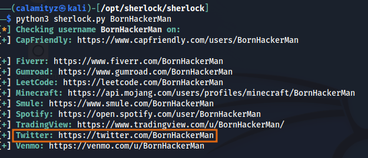
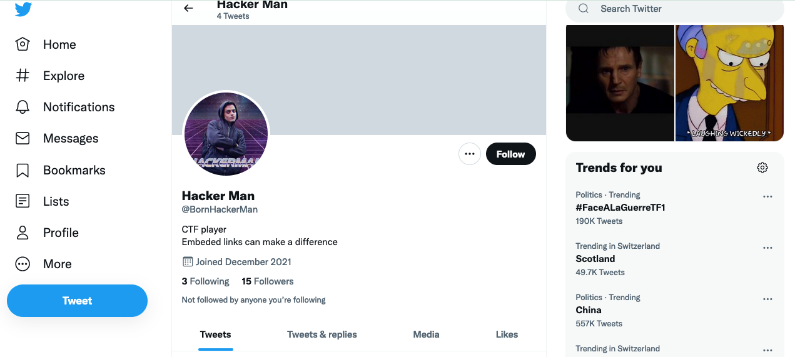
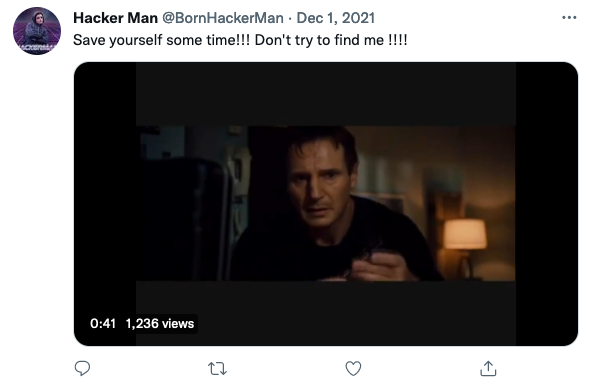
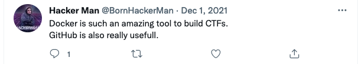
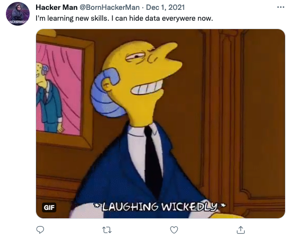
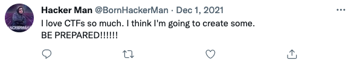
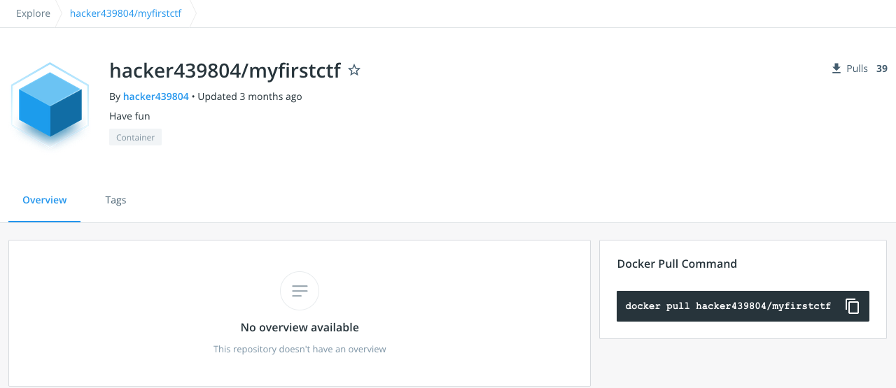
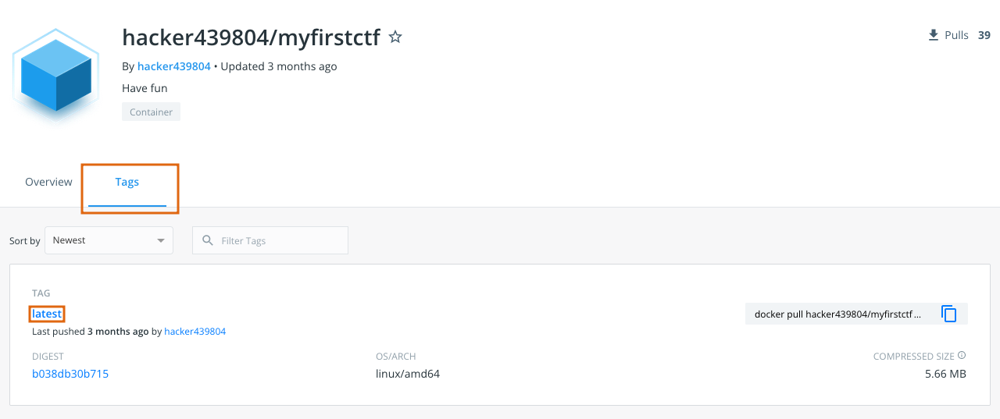

# The HackerMan

_Number of points : 491_

Instructions :
```
I found someone on social media, teasing a CTF he made but I couldn't find out more. I think his pseudonym was "BornHackerMan".
```

1. You can look for the different services where this pseudo is used with the python script [sherlock](https://github.com/sherlock-project/sherlock). You will get 11 answer, a few of them are false positive. 



2. What's really interesting is Born Hackerman twitter account.  


We can see he made 4 tweets (ordered by most recent) : 
- A video extact from Taken 1



- A tweet he wrote telling us he's using Github and Docker



- A GIF of Mr Burns , telling us he learned to hide data



-  A tweet telling us he's creating a new CTF

 
  
  3. Looking closely at the video we can see  there are subtitles. Activate them we get the following message :
  
  0:06/0:50 : * Dialing *\
  0:08/0:50 : * Ringing *\
  0:13/0:50 : I finish my first CTF *hurray*\
  0:17/0:50 : Find it at "hacker/[0-9]+/"\  
  0:19/0:50 : Signed: "The Hackeman"\
  
  We understand that "hacker/[0-9]+/"  is a regex pattern meaning we are looking for something with hacker followed by one or more numbers. 
  
  
 At this stage you were supposed to notice that you can get the number you were looking for was at the beginning of the video. Using DTFM and a tool such as [dCode](https://www.dcode.fr/code-dtmf). You would find the following number 439804.
 
 4. From the previous tweet we figured out he used docker to develop his first CTF. We went on the [docker hub]() registry and looked for the last container uploaded by someone with hacker in their pseudo. Sorting results by "Recently Updated", on page 3 we can find [hacker439804/myfirstctf](https://hub.docker.com/r/hacker439804/myfirstctf) container.
  
   
   
  We tried to pull the docker container and run it but nothing appeared.We didn't saw it but if you launch the container in interactive mode and you can find a file note.txt saying : "The flag is hidden inside this docker image...".
  
5. Instead we remembered that you can view the content of the Dockerfile by clicking on tag and the specific container. 
 
 