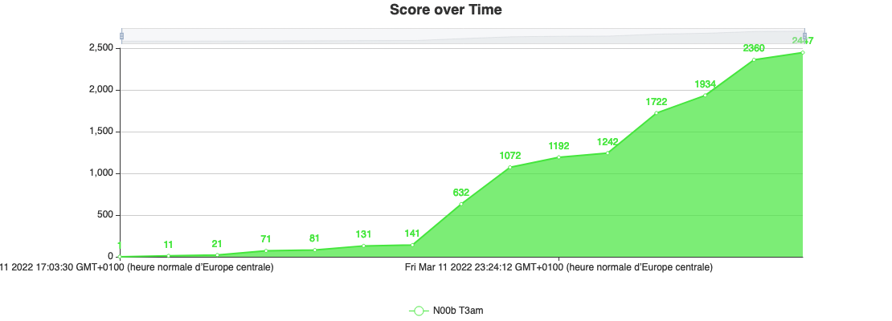

# dvCTF 2022

## List of challenges
- Stega
  - [The Arts of Details](./Steganography/The%20Arts%20of%20Details/) 
- Misc
  - [Dataleak](./Misc/Dataleak/)
  - [The HackerMan](./Misc/The%20HackerMan/)
- Programming
  - [Sudoku](./Programming/Sudoku/) 
- Pentest
  - [DaVinci's Playlist Part 1](./Pentest/DaVinci's%20Playlist%20Part%201/) 
- OSINT
  - [Monkeey](./OSINT/Monkeey/) 
  - [Elon Musk](./OSINT/Elon%20Musk/)
  - [Painting spot](./OSINT/Painting%20spot/) 
  - [Welcome to the DaVinciCTF!](./OSINT/Welcome%20to%20the%20DaVinciCTF!/) 
- Warmup
  - [Welcome](./Warmup/Welcome/) 
  - [FrenchFlag](./Warmup/FrenchFlag/)
  - [EBG13](./Warmup/EBG13/) 
  - [QmFzZTY0](./Warmup/QmFzZTY0/)
  - [MP3](./Warmup/MP3/) 
  - [RSA](./Warmup/RSA/) 

## Flag format
dvCTF{printable_ASCII_chars}

## Team Ranking
🏁 48th place
💯 2447 points

